## Дипломный проект.

### Краткое пояснение.
Для реализации проекта я использовал мощьности ЦОД компании. Среда виртуализации используется кластер VMWare. Мне была виделенна подсеть 10.122.207.0/28 расположено в ДМЗ с доступом в интернет. Дополнительно развернул haproxy(для балансировки), nfs сервер(для volumes) и jenkins сервер. Jenkins так же занимается отслеживанием изменений инфраструктуры с помощью github-webhook.

Код ифраструтуры: https://github.com/ArsalanSan/netology-dp \
Код приложения: https://github.com/ArsalanSan/dp-app.git \
Образ приложения: https://hub.docker.com/r/arsalansan/dp-app/tags

Ссылка на [тестовое приложение](http://dp-app.apctech.ru/) и [веб интерфейс Grafana](http://grafana.apctech.ru/)

## Этапы выполнения:

### Создание облачной инфраструктуры

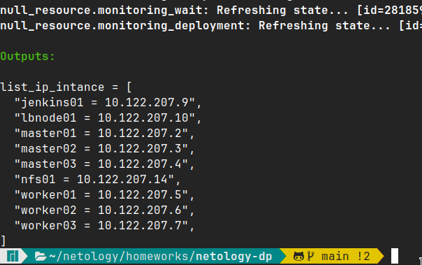
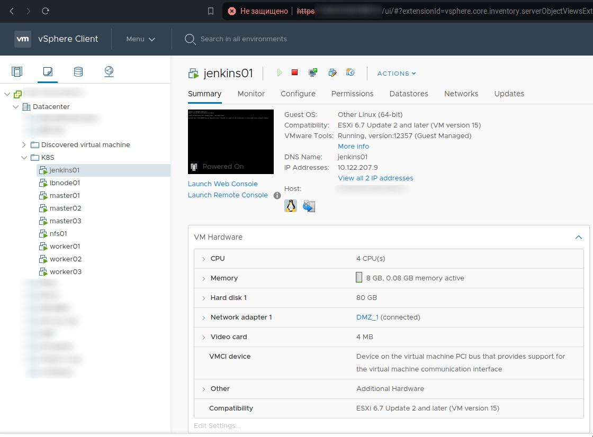

### Создание Kubernetes кластера

Создал ansible скрипт: https://github.com/ArsalanSan/netology-dp/blob/main/playbook/install_k8s.yaml

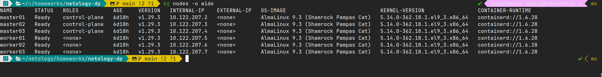

### Создание тестового приложения

Тестовое приложение: https://github.com/ArsalanSan/dp-app.git \
Регистри с собранным docker image: https://hub.docker.com/r/arsalansan/dp-app/tags

### Подготовка cистемы мониторинга и деплой приложения

Манифесты kube-prometheus: https://github.com/ArsalanSan/netology-dp/tree/main/manifests/kube-prometheus \
Ссылка на графану: http://grafana.apctech.ru/

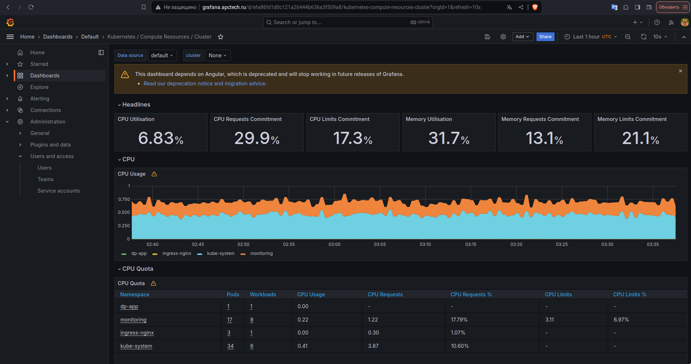

### Установка и настройка CI/CD

Пайплайн для создания докера: https://github.com/ArsalanSan/dp-app/blob/main/Jenkinsfile \
Пайплайн для отлеживания инфраструктуры: https://github.com/ArsalanSan/netology-dp/blob/main/Jenkinsfile

Создал ansible скрипт: https://github.com/ArsalanSan/netology-dp/blob/main/playbook/jenkins.yaml

### Скрины выполнения

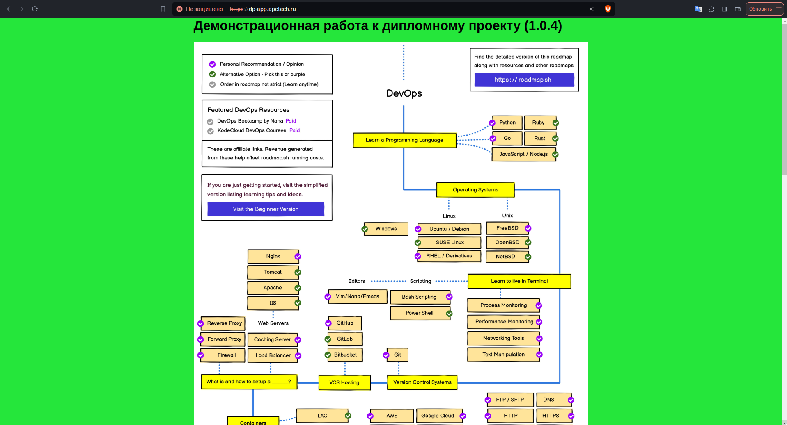
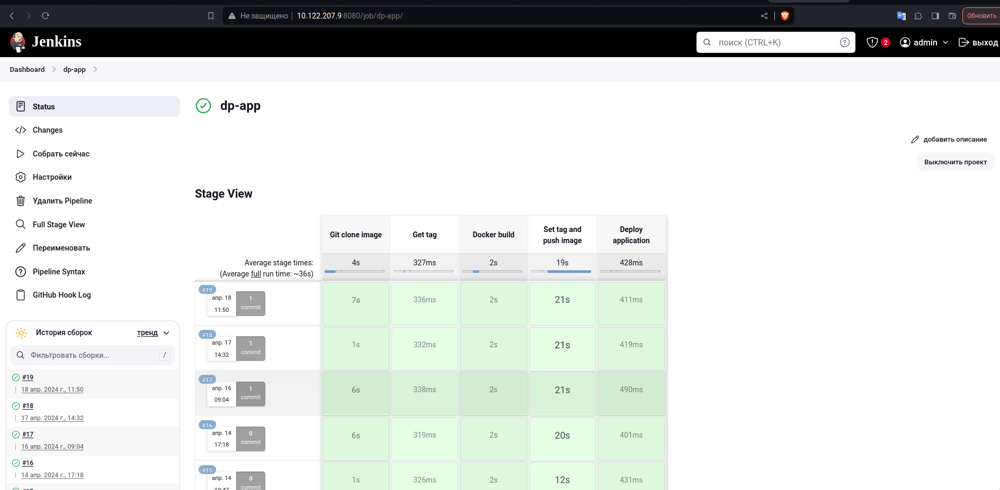
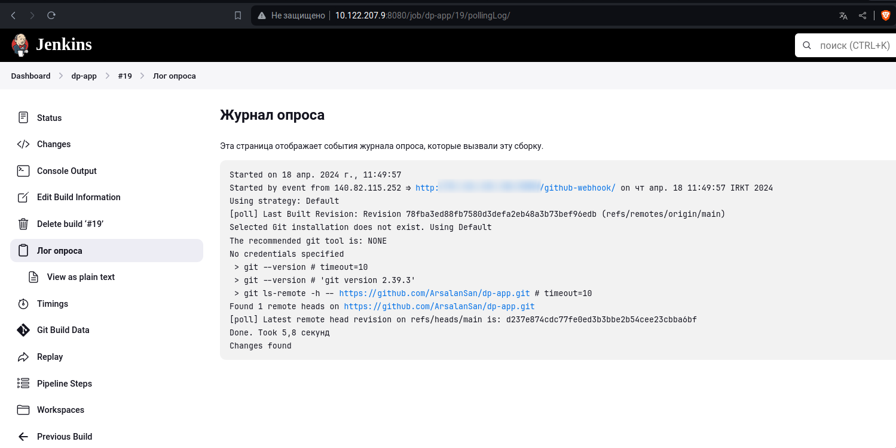
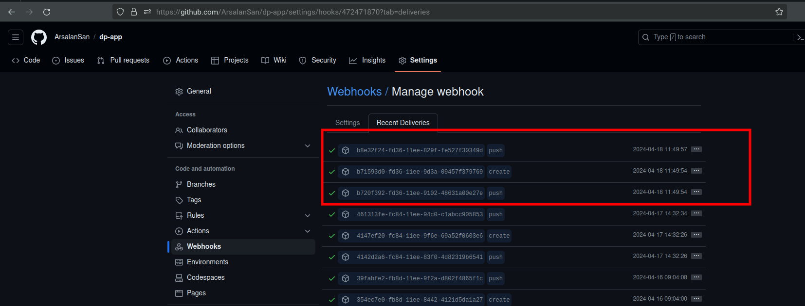
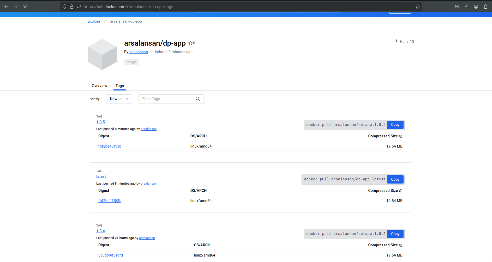
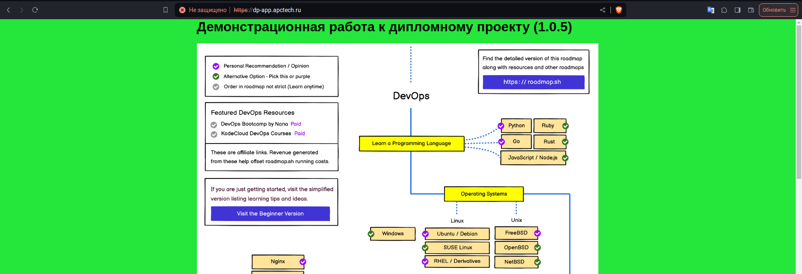

Артифакт терраформа хранится в jenkins
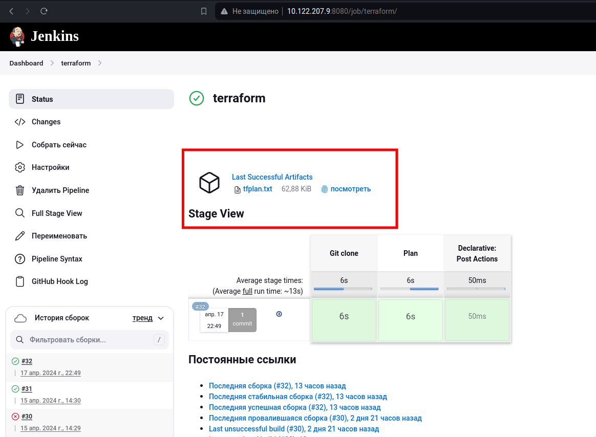

Backend S3 с блокировкой в YBD
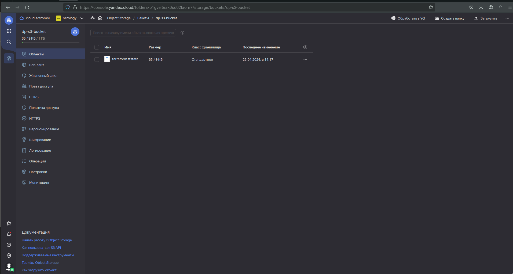